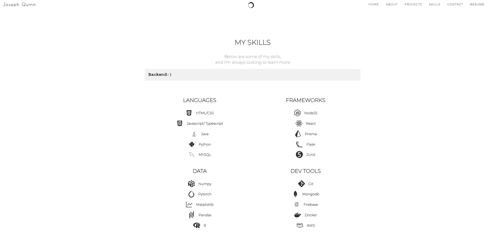

# Portfolio Website

I designed and developed this portfolio websites from scratch using the React framework. This site features custom layouts and interactive elements tailored to showcase my projects, experience, and achievements effectively. It it reposonve to any screensize desktop or mobile

  
  

The website is self-hosted through Netlify. You can view the live version here: [Portfolio Website](https://josephquinn.dev)
